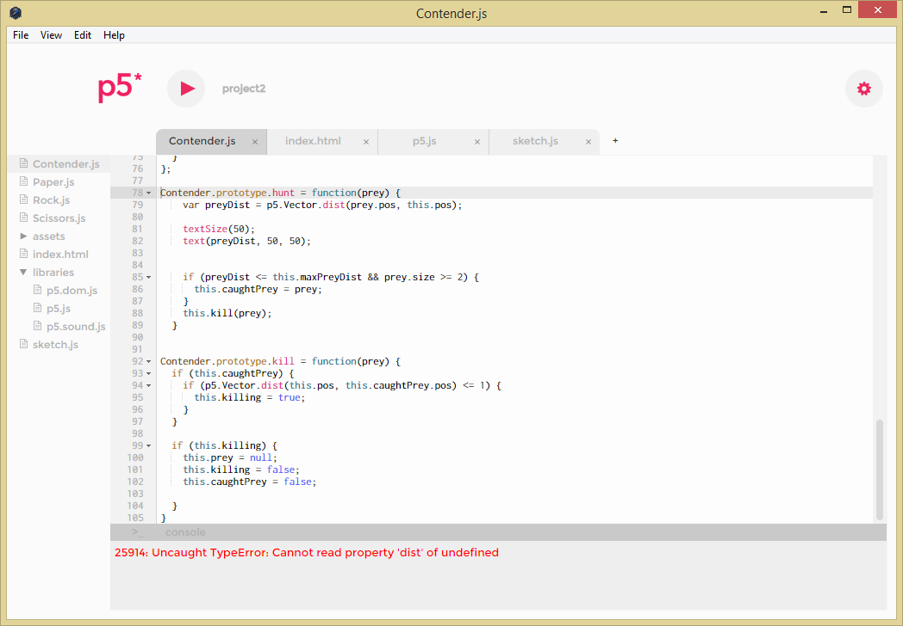
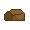
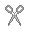
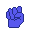

### Project 2
---
###### Roshambo
---
This program was a doozy. Most of spring break was spent staring at the screen, frustrated while the same error popped up that would not offer any solution or reason.

However, I have overcome this obstacle, as well as all the ones that popped up afterward. Here's all the fun stuff:

##### The Agents
The three agents of this program are Rock, Paper, and Scissors. I had been flip-flopping between having a single class and having three separate but identical classes, before settling on finally having one class to contain all the intelligence of each agent.

These were the original icons:
  

These are the new icons:
  

I color-coded them for clarity. I made the decision to make hand icons instead of the literal representations because the paper icon didn't show up very well with the background. These new icons are easy to see and are more aesthetically pleasing.

##### The Environment
The environment is a simple white screen. Before the change to hand icons, it used to be a subtle grey color as to keep the paper a little more visible. There are no external obstacles the agents have to navigate except for each other.

I detailed in my paper how I had an initial idea for defeated agents to leave behind corpses that would hinder any other entity that came into contact with them. I simply didn't have the time to incorporate this. It is also something that could only work with the original literal icons, as the sprites would change to torn up paper, covered rocks, or shattered scissors.

##### The System
Each entity hunts the object it defeats. Once it's locked on, the prey will shrink into nothing. Once there is only one type of agent left, a new wave of agents are immediately renewed. This will continue on forever.
