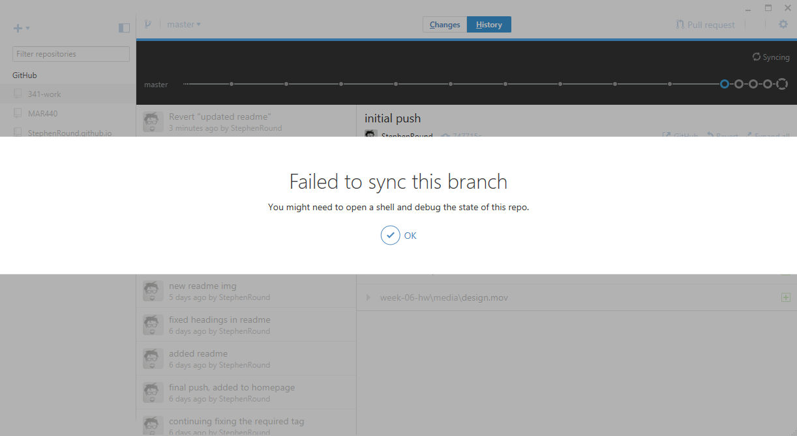
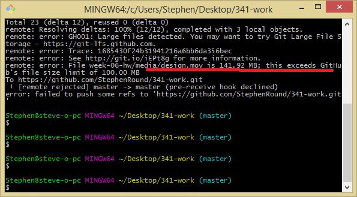
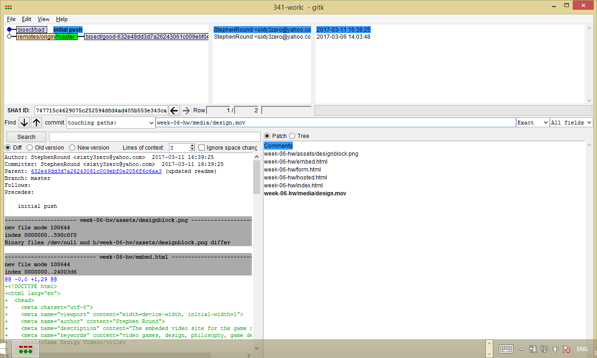
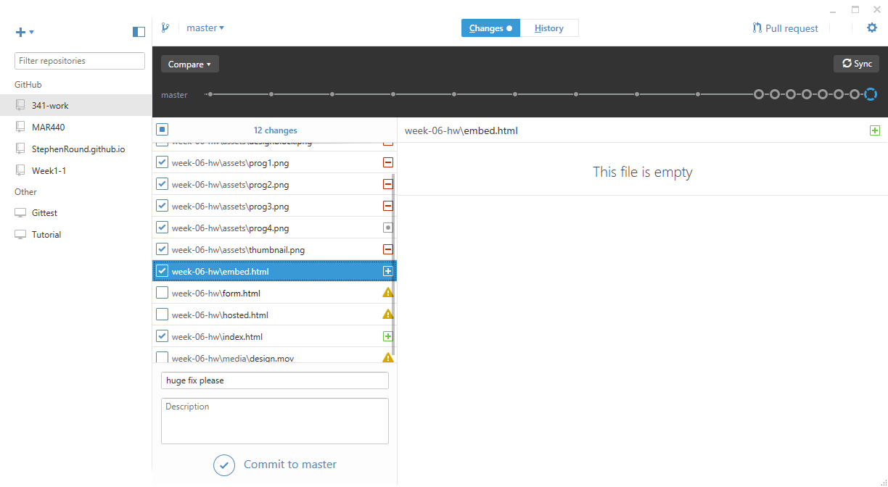
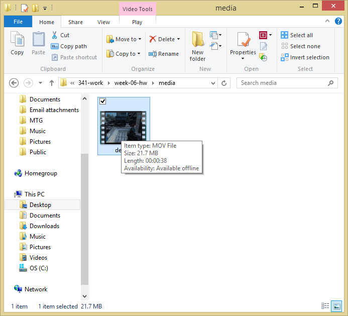

## Week 6
##### This week nearly broke me

I've never really had trouble getting things to work in this class up until now. While the actual html wasn't difficult to create, the wrestling match I had to do with github over the size of my hosted video file was excruciating. Not to mention the amount of times my computer just decided to quit while I was editing said video.

##### The Struggle

*Oh, that's odd. Probably had something to do with the 141MB video. I tried to remove it from the directory manually, but github just wasn't having it.*

*Yep, the video is the culprit. Let's see what I can do about that... Surely one of these commands will help me right?*

*I managed to isolate what the bad commit was--the first one I did for the week. However, this interface is so unintuitive, but I really wanted to get the ghost of this video out of my repo.*

*Well dang.*

*My 341-work repo is now bugged to all hell. Welcome to my MAR440 repo, which is going to be a temporary home for my 341 work until I get this sorted out.*

*At the very least, I got my video file smaller and working. So that's great.*

Overall, this week was strenuous. There was a lot to do for this assignment and the time to do it was quickly fleeting in the ebb and flow of college life. All this github tomfoolery didn't help either. __If you haven't committed your files yet, make sure your video file isn't 100 MB or more. __
